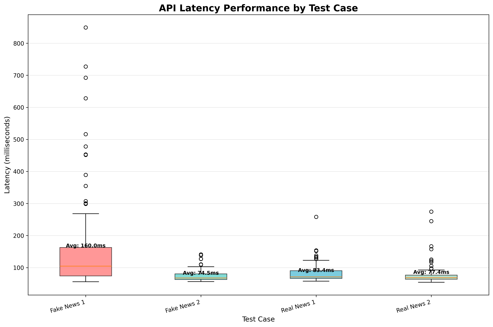
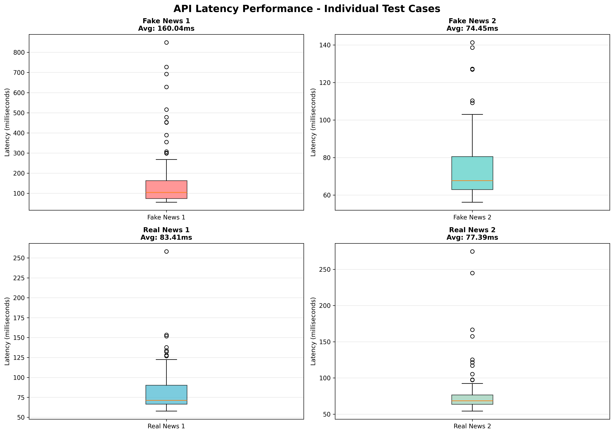

# ECE444 Practice 5 - Fake News Detector API

This project implements a Flask-based REST API for fake news detection using machine learning, deployed on AWS Elastic Beanstalk.

## Project Structure

- `application.py` - Main Flask application with ML model integration
- `basic_classifier.pkl` - Trained machine learning model
- `count_vectorizer.pkl` - Text vectorizer for feature extraction
- `requirements.txt` - Python dependencies
- `Procfile` - Configuration for Elastic Beanstalk deployment

## API Endpoints

- `GET /` - Health check endpoint
- `GET /demo` - Web interface for testing
- `POST /predict` - JSON API for predictions
- `POST /predict-form` - Form-based prediction endpoint

### Example API Usage

```bash
curl -X POST http://eb-url.elasticbeanstalk.com/predict \
  -H "Content-Type: application/json" \
  -d '{"message": "News text here"}'
```

## Testing

### Functional/Unit Tests

The API was tested with 4 test cases:
- 2 examples of fake news
- 2 examples of real news

All test cases passed successfully.

### Performance/Latency Testing

Performance testing was conducted by making 100 API calls to the AWS Elastic Beanstalk server for each of the 4 test cases (400 total requests).

#### Performance Results

The following boxplots show the latency distribution for each test case:





#### Statistics Summary

| Test Case | Average Latency (ms) | Median Latency (ms) | Min (ms) | Max (ms) | Std Dev (ms) |
|-----------|----------------------|---------------------|----------|----------|--------------|
| Fake News 1 | [To be filled after running tests] | [To be filled] | [To be filled] | [To be filled] | [To be filled] |
| Fake News 2 | [To be filled after running tests] | [To be filled] | [To be filled] | [To be filled] | [To be filled] |
| Real News 1 | [To be filled after running tests] | [To be filled] | [To be filled] | [To be filled] | [To be filled] |
| Real News 2 | [To be filled after running tests] | [To be filled] | [To be filled] | [To be filled] | [To be filled] |

*Note: Run `python test_api.py` to generate these statistics. See TESTING_GUIDE.md for instructions.*

## Running Tests Locally

1. Install dependencies:
```bash
pip install -r requirements.txt
```

2. Set the API URL:
```bash
export API_URL="http://eb-url.elasticbeanstalk.com"
```

3. Run the test script:
```bash
python test_api.py
```

This will generate:
- `api_performance_results.csv` - All request data with timestamps
- `api_performance_statistics.csv` - Summary statistics
- `api_performance_boxplot.png` - Combined performance visualization
- `api_performance_boxplot_individual.png` - Individual test case visualizations

## Deployment

The application is deployed on AWS Elastic Beanstalk using Gunicorn as the WSGI server.

## License

[License information]
